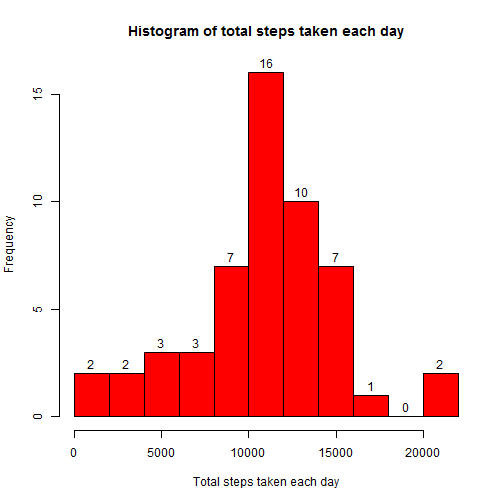
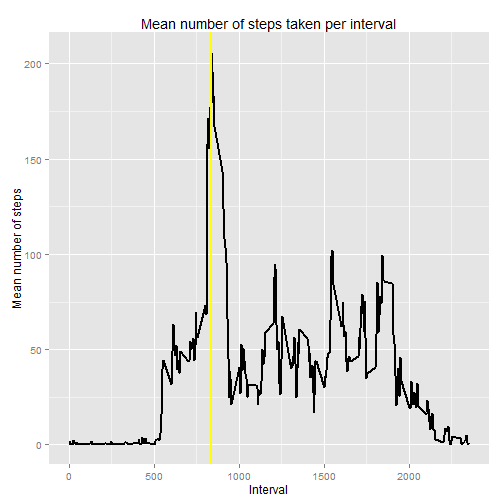
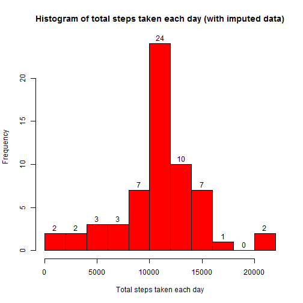
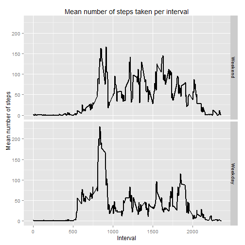

Peer Assessment 1
==========================================


## Loading and preprocessing the data  
Load necessary packages.


```r
require(data.table)
require(dplyr)
require(ggplot2)
require(timeDate)
```

Read in the data, omitting the missing data.


```r
activity <- na.omit(read.csv("./activity.csv"))
```

## What is mean total number of steps taken per day?

Summarize the data to determine the total number of steps taken by date.


```r
steps <- as.data.frame(activity %>% group_by(date) %>% summarize(sum(steps)))
colnames(steps) <- c("date","sum.steps")
print(steps)
```

```
##          date sum.steps
## 1  2012-10-02       126
## 2  2012-10-03     11352
## 3  2012-10-04     12116
## 4  2012-10-05     13294
## 5  2012-10-06     15420
## 6  2012-10-07     11015
## 7  2012-10-09     12811
## 8  2012-10-10      9900
## 9  2012-10-11     10304
## 10 2012-10-12     17382
## 11 2012-10-13     12426
## 12 2012-10-14     15098
## 13 2012-10-15     10139
## 14 2012-10-16     15084
## 15 2012-10-17     13452
## 16 2012-10-18     10056
## 17 2012-10-19     11829
## 18 2012-10-20     10395
## 19 2012-10-21      8821
## 20 2012-10-22     13460
## 21 2012-10-23      8918
## 22 2012-10-24      8355
## 23 2012-10-25      2492
## 24 2012-10-26      6778
## 25 2012-10-27     10119
## 26 2012-10-28     11458
## 27 2012-10-29      5018
## 28 2012-10-30      9819
## 29 2012-10-31     15414
## 30 2012-11-02     10600
## 31 2012-11-03     10571
## 32 2012-11-05     10439
## 33 2012-11-06      8334
## 34 2012-11-07     12883
## 35 2012-11-08      3219
## 36 2012-11-11     12608
## 37 2012-11-12     10765
## 38 2012-11-13      7336
## 39 2012-11-15        41
## 40 2012-11-16      5441
## 41 2012-11-17     14339
## 42 2012-11-18     15110
## 43 2012-11-19      8841
## 44 2012-11-20      4472
## 45 2012-11-21     12787
## 46 2012-11-22     20427
## 47 2012-11-23     21194
## 48 2012-11-24     14478
## 49 2012-11-25     11834
## 50 2012-11-26     11162
## 51 2012-11-27     13646
## 52 2012-11-28     10183
## 53 2012-11-29      7047
```
 
Create histogram of the total number of steps taken each day (each column represents the frequency of that bin of steps).


```r
hist(as.numeric(steps[,2]), breaks = 10, 
main = "Histogram of total steps taken each day", 
xlab = "Total steps taken each day",
col = "red", 
labels = TRUE)
```

 

Calculate mean and median of the data.


```r
mean(as.numeric(steps[,2]))
```

```
## [1] 10766.19
```

```r
median(as.numeric(steps[,2]))
```

```
## [1] 10765
```

# What is the average daily activity pattern?

Make a time series plot (i.e. type = "l") of the 5-minute interval (x-axis) and the average number of steps taken, averaged across all days (y-axis)

First, aggregate data by the average number of steps per interval and then rename the columns.


```r
steps2 <- as.data.frame(activity %>% group_by(interval) %>% summarize(mean(steps)))
colnames(steps2) <- c("interval","meansteps")
```

Then, plot the aggregated time series data. The vertical yellow line represents the max value.


```r
y <- ggplot(steps2, aes(x = interval, y = meansteps)) + 
    labs(y = "Mean number of steps",
           x = "Interval") +
    ggtitle("Mean number of steps taken per interval")
      
y + geom_line(size = 1) + 
geom_vline(xintercept = arrange(steps2, desc(meansteps))[1,1], color = "yellow", size = 1)
```

 

Find the interval with the max number of steps.


```r
arrange(steps2, desc(meansteps))[1,1]
```

```
## [1] 835
```

# Impute missing values

Calculate and report the total number of missing values in the dataset (i.e. the total number of rows with NAs)


```r
activity <- (read.csv("./activity.csv"))
nrow(activity[!complete.cases(activity),])
```

```
## [1] 2304
```

Replace NA values with their interval means.


```r
activity <- as.data.table(activity)
activity$steps <- as.numeric(activity$steps)

activity2 = copy(activity)

activity2 <- activity2[,steps := ifelse(is.na(steps), mean(steps, na.rm=TRUE), steps), by = interval]
```

Summarize date to see the total number of steps per day.


```r
steps3 <- as.data.frame(activity2 %>% group_by(date) %>% summarize(sum(steps)))
colnames(steps3) <- c("date","sum.steps")
```

Create historgarm with imputed data.


```r
hist(as.numeric(steps3[,2]), breaks = 10, 
main = "Histogram of total steps taken each day (with imputed data)", 
xlab = "Total steps taken each day",
col = "red",
labels = TRUE)
```

 

Find mean and median with the new imputed data.


```r
mean(as.numeric(steps3[,2]))
```

```
## [1] 10766.19
```

```r
median(as.numeric(steps3[,2]))
```

```
## [1] 10766.19
```

After replacing the missing data, the mean value stays the same and the median value changes slightly. The histogram with imputed missing values show that the middle bin has values now - the other bins aren't affected.

# Are there differences in activity patterns between weekdays and weekends?

Determine whether each day is a weekday (TRUE) or not (FALSE).


```r
activity2[,weekday:=isWeekday(date)]
```

Summarize data by interval and weekday Vs. weenend and relabel True/False values as "Weekend" or "Weekday".


```r
activity_w <- activity2[, mean(steps), by = list(interval, weekday)]
activity_w$day <- factor(activity_w$weekday, labels = c("Weekend", "Weekday"))
```

Plot data by weekday vs. weekend.


```r
y <- ggplot(activity_w, aes(x = interval, y = V1)) + 
    labs(y = "Mean number of steps",
           x = "Interval") +
    ggtitle("Mean number of steps taken per interval")+
    facet_grid(day~.)
      

y + geom_line(size = 1)
```

 

Comparing the plots visually, we can see some differences between the weekday and weekend data:

* more steps taken on weekdays in intervals 500 to 1000 than on the weekends. 
* generally more steps taken on weekends in intervals 1000 to 2400 than on the weekdays.
